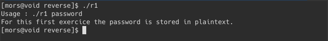
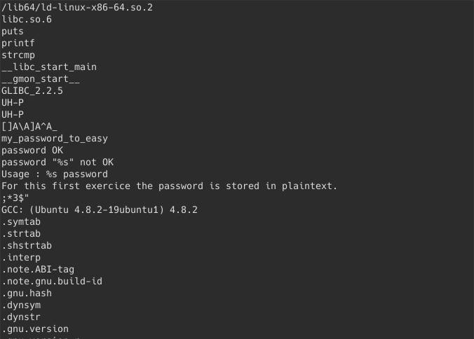
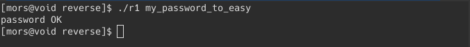

The goal is make the program print `password OK`

First, execute the program:

By running the program, it prints the ‘Usage’ of it. The Usage gave us a hint that the password is in plaintext (hard-coded in the program).

Using the strings program, then piping it to less:

We will get this output:

just by skimming through the text, we see the string “my_password_to_easy”, by intuition, we thought that this might be the password and try it as an argument to the program.

and we're done.
