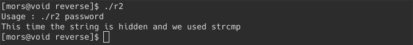
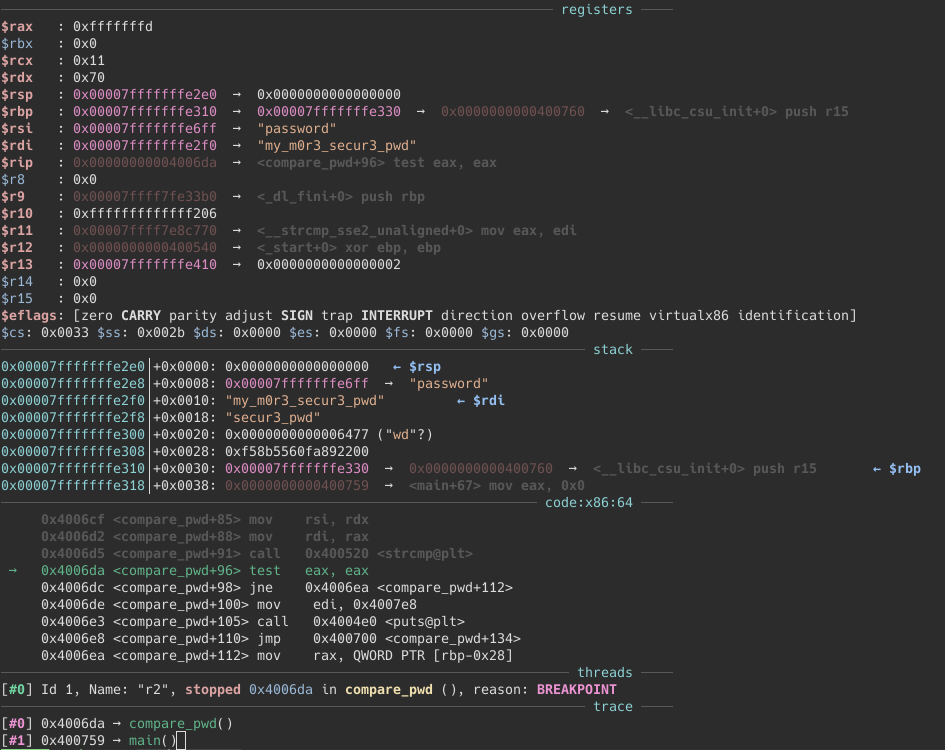

The goal is make the program print `password OK`

First, we execute the program:

The hint we get in this program is that the password is hidden and used strcmp.

Using the strings program and hoping that the password is there:

Unfortunately, we did not see a potential password here in the output.

Using the program objdump, then piping it to grep:

We get this list of functions. What got our interest are the functions <main>, <compare_pwd>, and <get_pwd>.

We fire up gdb w/ GEF, and disassemble the <compare_pwd> function:

As hinted from the beginning, that the password is hidden using strcmp. We created a breakpoint at the address of calling the strcmp function:

then, and run the program with argument:

We will see in the stack section the argument we use running the program, and the string “my_m0r3_secur3_pwd” that the program compares our argument.
    
it really looks like the password we are looking for.
   
trying it

and done.
