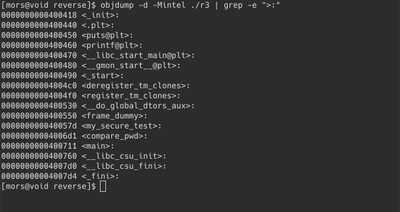
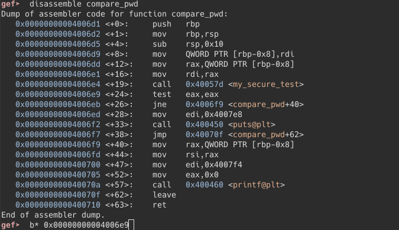

The goal is make the program print `password OK`

First, we execute the program:

Ok...., well glhf.
 
using objdump to see the functions, you know the drill: 
 

 
What got our interest here are the <my_secure_test> and <compare_pwd>.

we now check it in gdb, create a breakpoint in the compare_pwd function like the last exercise:

then run it with an argument:

We did not see a potential password in the registers or in the stack.

it's ok, we still have ‘my_secure_test’ function to test.

Holy crap! it's too long.
    
it test al, al, if it is equal, we exit?? ok, it is probably in a loop ( *spoiler* not in a loop but if-else statement), can't explain it though. and cmp al to some hex characters.

To make it easier to visualize, we use Cutter program to graph the function (alternatively, you can also use r2 to view the graph: seek to the function then ‘VV’)

by isolating cmp instruction using objdmp, then piping it to grep:

we will get this, then using python3 converting hex to chr:

then trying

and done.
