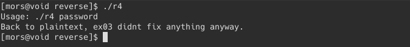
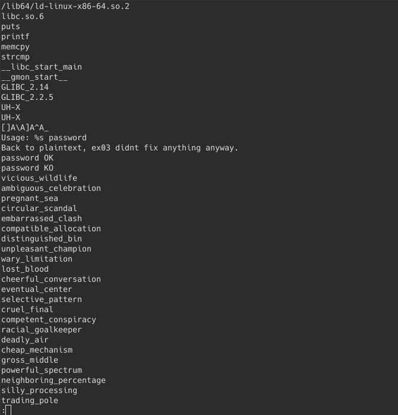
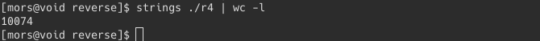
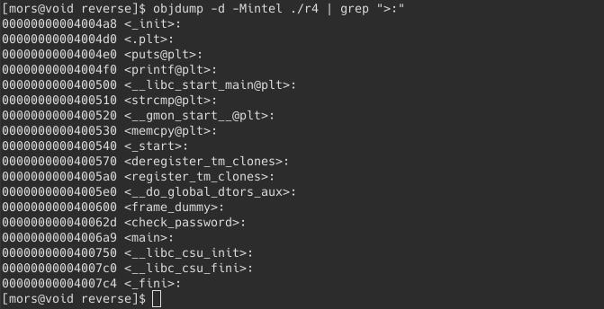
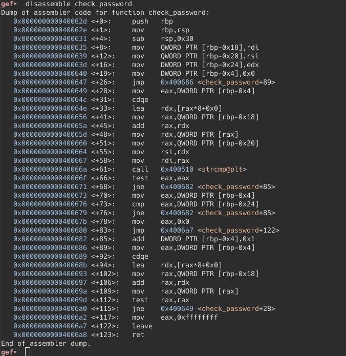
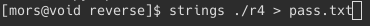
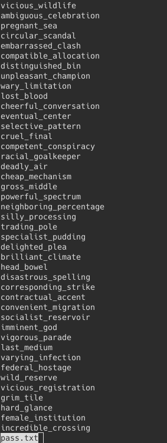
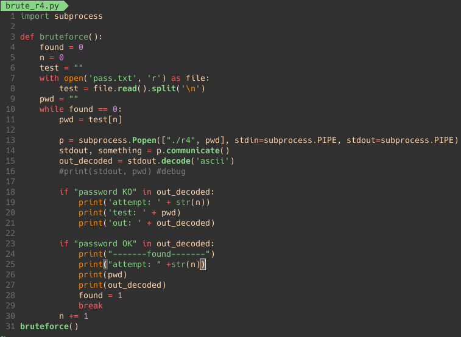
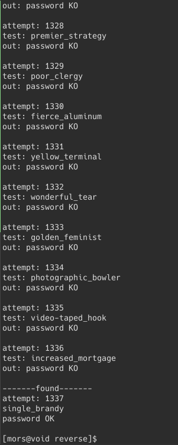

The goal is make the program print `password OK`

First, we execute the program:

Oh.. plaintext again, just like r1

Using strings program, piping it to less

 
we get this line of text, which is too many text, by what I mean of too many,
using wc:

    
yup.. that many.

objdump the functions

there is a <check_password> function avail.

disassembling the <check_password> function using gdb:

OK, I lost it. I don't understand any of it.
    
    TO BE CONTINUED..
    
Mission: create a bruteforce check program.

since there are too many possible password, I decided to create a python bruteforce test.

first we redirect the output of “strings ./r4” to pass.txt

we clean it, remove the unnecessary strings

python code:

thank you python3 documentation, stackoverflow, and this [site](https://www.thecrowned.org/brute-force-crackme-file-password-python) for the code reference

and here is the python output. that attemp number tho.
